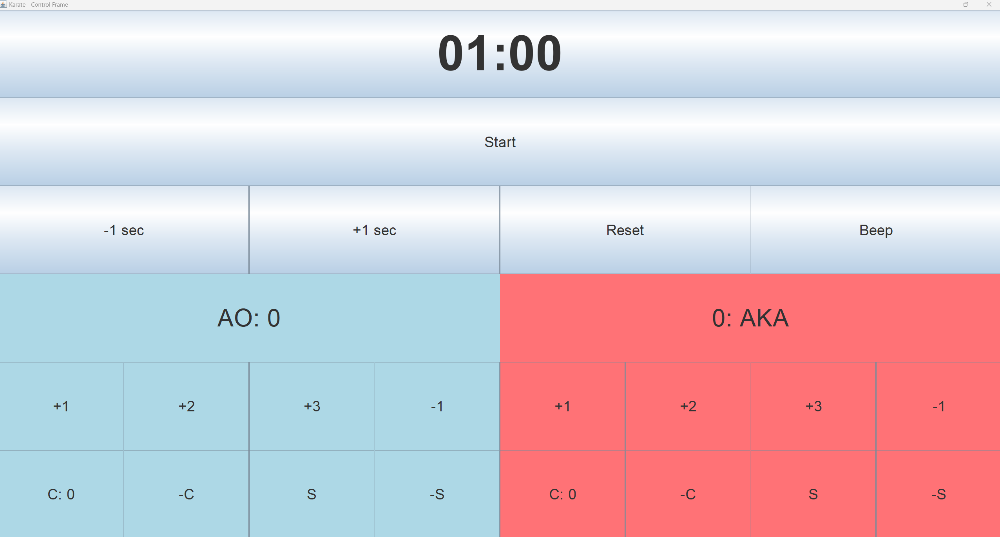

# KarateScoreBoardReference

🥋 Karate Scoreboard
Welcome to Karate Scoreboard – a Java-based digital scoreboard crafted for karate competitions! This project was developed using Object-Oriented Programming (OOP) principles to provide a robust, modular, and efficient solution for real-time score display.

Note: This project has been uploaded as a reference work for showcasing Java OOP in a practical application.

🚀 Features
Customizable display: The font and the size of the letters can be easily customized to fit any gear.
OOP Structure: Built with a modular approach using core OOP principles, making it easy to understand, expand, and maintain.
User-Friendly Controls: Designed for ease of use by judges or other competition staff, ensuring smooth operation in high-paced match settings. Learning the controls takes only minutes!
Automatic senshu calculation: senshu in karate is a special indicator you get if you get the first score. If at the end of the match, the scores are even, the competitor with the senshu wins.

📸 The displays
The program has 2 displays: a control and a display frame.
The intented use is:

This goes on your laptop screen:

And this to the screen / tv facing the tatami:

💻 Using the program
We actually use this program in our in-house competitions. It has had several iterations, bug fixes and got a few new features since i started this project, but we are quite happy with it now.
